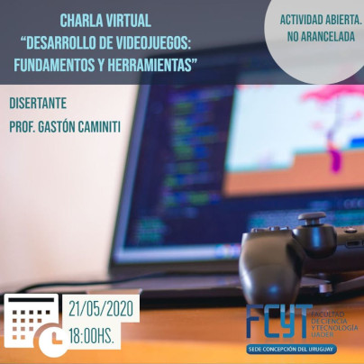

# Desarrollo de Videojuegos: Fundamentos y Herramientas
Recursos empleados en la charla virtual “Desarrollo de Videojuegos: Fundamentos y Herramientas”.
Facultad de Ciencia y Tecnología, sede Concepción del Uruguay, de la Universidad Autónoma de Entre Ríos.

    

